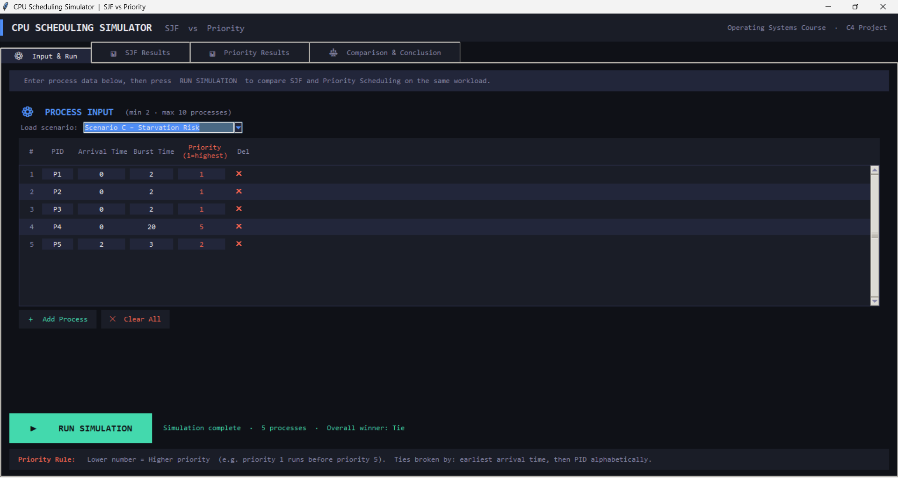
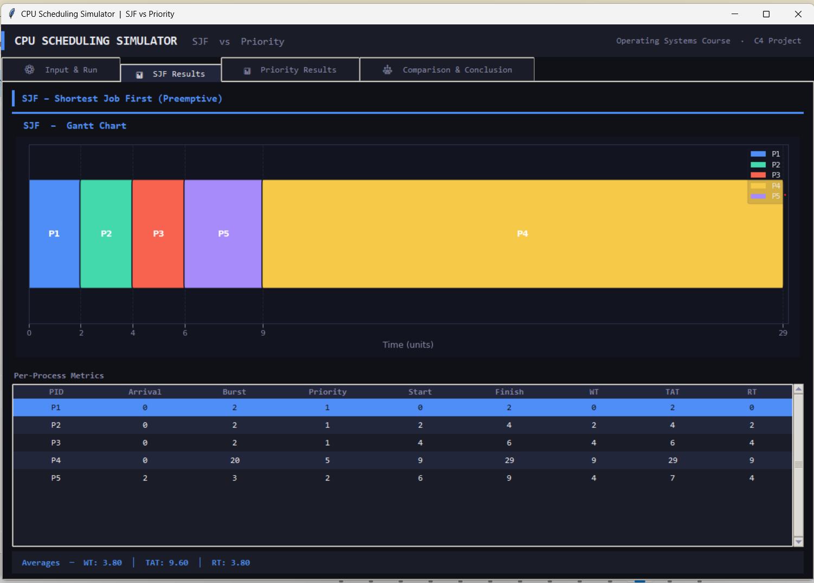
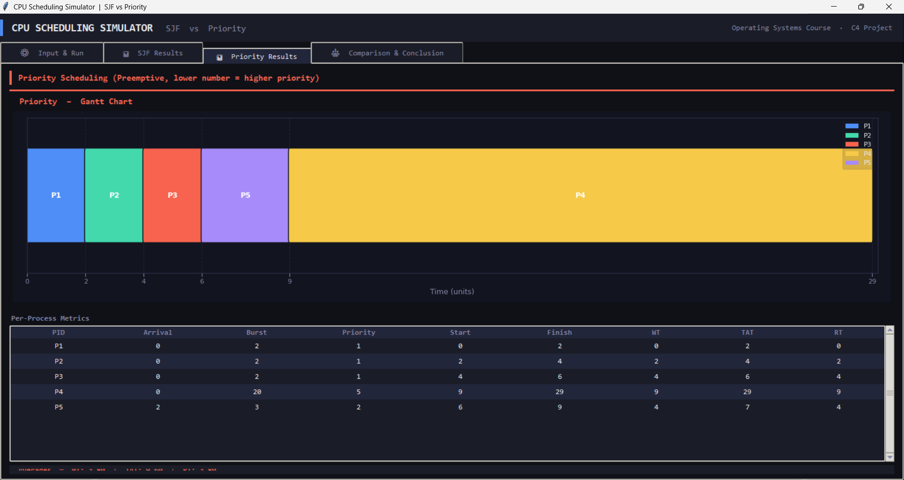
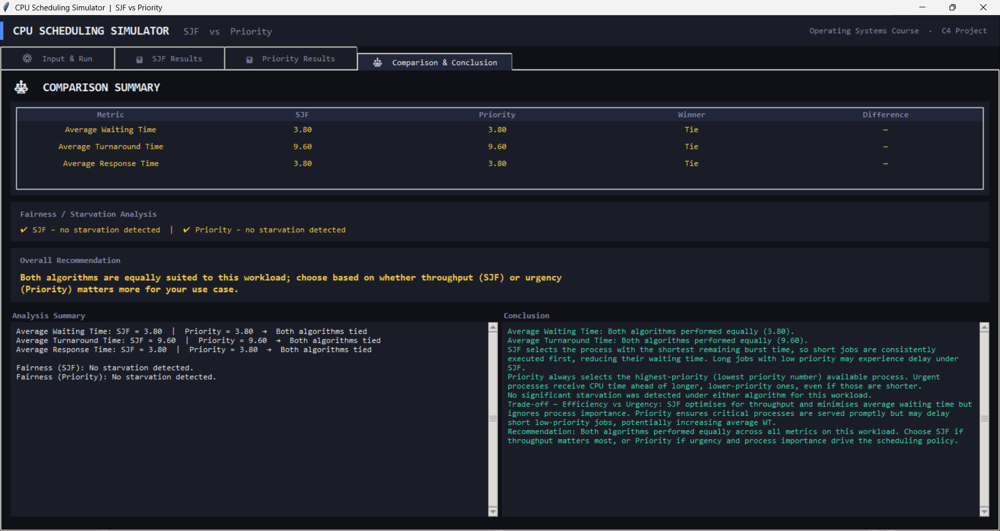

<div align="center">

#  CPU Scheduling Simulator

### SJF vs Priority Scheduling — Interactive Comparison Desktop Application

> A professional desktop simulator that implements and compares **Shortest Job First (SJF)** and **Priority Scheduling** algorithms side-by-side — complete with real-time Gantt charts, per-process metrics, starvation analysis, and an intelligent comparison engine.

</div>

---

##  Table of Contents

- [Project Overview](#-project-overview)
- [Features](#-features)
- [GUI Preview](#-gui-preview)
- [Project Structure](#-project-structure)
- [Architecture & Design Principles](#-architecture--design-principles)
- [Scheduling Algorithms](#-scheduling-algorithms)
- [Metrics Explained](#-metrics-explained)
- [Installation Guide](#-installation-guide)
- [Requirements](#-requirements)
- [Running Tests](#-running-tests)
- [Example Scenarios](#-example-scenarios)
- [Validation Rules](#-validation-rules)
- [Comparison System](#-comparison-system)
- [Required Analysis Questions](#-Required-Analysis-Questions)
- [Team Contributions](#-team-contributions)
- [Conclusion](#-conclusion)

---

##  Project Overview

**CPU Scheduling** is one of the fundamental responsibilities of any operating system. The scheduler decides which process gets CPU time, for how long, and in what order — decisions that directly affect system responsiveness, throughput, and fairness.

This simulator was built as part of an **Operating Systems course project** to study and compare two fundamentally different scheduling philosophies:

| Philosophy | Algorithm | Core Question |
|---|---|---|
| **Efficiency-first** | SJF Preemptive | Which job finishes fastest? |
| **Urgency-first** | Priority Scheduling | Which job is most important? |

### What does this simulator demonstrate?

- How **job length** (burst time) and **urgency** (priority) lead to different execution orders on identical workloads
- The real-world cost of optimizing only for throughput (SJF may starve long, low-priority jobs)
- The real-world cost of optimizing only for urgency (Priority may delay short but unimportant jobs)
- How to **measure fairness** through starvation analysis
- How scheduling decisions translate into concrete metrics: WT, TAT, and RT

### Educational Purpose

This project bridges the gap between theoretical OS concepts and hands-on engineering. By running both algorithms on the same dataset and visualizing the results as Gantt charts, students and developers can directly observe the behavioral differences — not just read about them.

---

##     Features

###  Interactive GUI
- Dark-themed, modern desktop interface built with **Tkinter**
- Tabbed layout separating Input, SJF Results, Priority Results, and Comparison
- Fully responsive to window resizing

###  Dynamic Process Table
- Add or remove processes at runtime (2–10 processes supported)
- Each process accepts: PID, Arrival Time, Burst Time, and Priority
- Scrollable table with alternating row colors for readability

###  Robust Validation System
- Real-time rejection of all invalid inputs before simulation begins
- Detailed, human-readable error messages pinpointing the exact problem
- Covers: negative values, zero burst time, non-integer input, duplicate PIDs, out-of-range priority, and missing fields

###  Built-in Scenario Presets
- Four pre-designed test scenarios loadable from a dropdown menu
- Covers: basic workload, burst-vs-priority conflict, starvation risk, and invalid input demonstration

###  Dual Gantt Chart Visualization
- Separate, color-coded Gantt chart rendered for each algorithm using **Matplotlib**
- Distinct colors per process, clear time markers, idle CPU indication
- Charts update live after every simulation run

###  Complete Metrics Calculation
- Per-process: **Waiting Time (WT)**, **Turnaround Time (TAT)**, **Response Time (RT)**
- System-wide averages for all three metrics

###  Intelligent Comparison Engine
- Side-by-side metric comparison table with winner highlighted per metric
- Overall winner determined by majority of metrics won
- Auto-generated textual analysis and recommendation

###  Starvation Analysis
- Detects processes that waited significantly longer than the group average
- Reports starvation risk per algorithm, per process ID
- Uses a configurable multiplier threshold (`STARVATION_MULTIPLIER = 2.5`)

###  Dark Mode UI
- Consistent dark color palette designed for long study sessions
- Accent colors differentiate SJF (blue) from Priority (red/orange)

###  Modular Architecture
- Clean separation between data models, business logic, and presentation layer
- Each module has a single, clearly defined responsibility
- Backend is fully testable independently of the GUI

---

##  GUI Preview

> **Note:** Replace the placeholder paths below with actual screenshots after running the application.

### Main Input Panel

*Dynamic process entry table with scenario presets and validation feedback*

### SJF Results Tab

*Gantt chart, per-process metrics table, and averages for Shortest Job First*

### Priority Results Tab

*Gantt chart, per-process metrics table, and averages for Priority Scheduling*

### Comparison & Conclusion Tab

*Side-by-side metric comparison, starvation analysis, recommendation, and technical conclusion*

---

##  Project Structure

```
cpu_scheduler/
│
├── main.py                    ← Application entry point
├── models.py                  ← Process data model and factory function
├── validator.py               ← Input validation logic
├── requirements.txt           ← Python dependencies
├── README.md                  ← Project documentation
│
├── algorithms/                ← Scheduling algorithm implementations
│   ├── __init__.py
│   ├── sjf.py                 ← Preemptive Shortest Job First
│   └── priority.py            ← Preemptive Priority Scheduling
│
├── metrics/                   ← Performance measurement and comparison
│   ├── __init__.py
│   ├── calculator.py          ← WT, TAT, RT computation
│   └── comparison.py          ← Algorithm comparison engine
│
├── gui/                       ← All user interface components
│   ├── __init__.py
│   ├── main_window.py         ← Root window, tabs, simulation orchestration
│   ├── gantt_chart.py         ← Matplotlib-based Gantt chart widget
│   └── input_panel.py        ← Process input table and scenario loader
│
└── tests/                     ← Automated test suite
    ├── test_sjf.py            ← SJF correctness and edge-case tests
    ├── test_priority.py       ← Priority scheduling correctness tests
    └── test_metrics.py        ← Metrics calculation accuracy tests
```

### File Responsibilities

| File | Responsibility |
|------|---------------|
| `main.py` | Bootstraps the application; adds project root to `sys.path`; calls `MainWindow().mainloop()` |
| `models.py` | Defines the `Process` dataclass with fields and metric computation methods; provides `create_process_list()` factory |
| `validator.py` | Validates all raw string input before any algorithm runs; returns structured `ValidationResult` |
| `algorithms/sjf.py` | Implements preemptive SJF using a tick-by-tick simulation loop; produces a Gantt entry list |
| `algorithms/priority.py` | Implements preemptive Priority Scheduling; tie-breaking by arrival time then PID |
| `metrics/calculator.py` | Calls `calculate_metrics()` on each `Process` after simulation; computes and returns averages |
| `metrics/comparison.py` | Compares two `AlgorithmResult` objects; generates summary lines, conclusion, and recommendation |
| `gui/main_window.py` | Owns the notebook layout; orchestrates the full simulation pipeline on button press |
| `gui/gantt_chart.py` | Renders Matplotlib Gantt charts embedded in a Tkinter frame; handles figure lifecycle |
| `gui/input_panel.py` | Manages the scrollable row-based process entry table; handles scenario loading |
| `tests/` | Pytest-based unit tests covering algorithm correctness, edge cases, and metric accuracy |

---

##  Architecture & Design Principles

###  Core Principles
*   **Single Responsibility (SRP):** Each module has a specific role—Validation, Scheduling, and Rendering are strictly decoupled for better maintainability.
*   **Separation of Concerns:** A clear boundary exists between the **GUI (Presentation Layer)** and the **Scheduling Logic (Business Layer)**.
*   **State Isolation:** Algorithms operate on independent data copies to prevent cross-interference during simultaneous simulation.

###  Simulation Pipeline
1.  **Validation:** `Validator` audits raw input for errors or logical inconsistencies.
2.  **Cloning:** `deepcopy` creates independent process lists for each algorithm.
3.  **Execution:** SJF and Priority algorithms process their respective lists concurrently.
4.  **Metrics:** `Calculator` computes WT, TAT, and RT; `Comparison` engine evaluates the winner.
5.  **Visualization:** Matplotlib renders dynamic Gantt charts for the final UI output.

### Why `deepcopy`?

Both algorithms mutate `Process` objects in-place (`remaining_time`, `start_time`, `completion_time`). Without deep copying, running SJF first would leave all processes with `remaining_time = 0`, and Priority Scheduling would find no work to do. Deep copying ensures each algorithm operates on a completely fresh, independent set of process objects.

---

##  Scheduling Algorithms

### Algorithm A — Shortest Job First (Preemptive / SRTF)

**Definition:** At every CPU tick, the scheduler selects the available process with the smallest remaining burst time. If a newly arriving process has a shorter remaining time than the currently running process, it preempts it immediately.

**Tie-Breaking Rule:** When two processes have equal remaining burst time, the one with the earlier arrival time is preferred. If still tied, alphabetical PID order is used.

**Advantages:**
- Minimizes average waiting time (provably optimal for average WT among non-aging algorithms)
- Maximizes CPU throughput
- Short jobs are never unnecessarily delayed by long ones

**Disadvantages:**
- Requires knowledge of future burst times (impractical in real OSes without prediction)
- Long processes may starve indefinitely if short processes keep arriving
- Ignores process importance entirely — a critical system process waits behind a trivial short job

**Time Complexity:** O(n) per tick for ready queue selection — O(n·T) total where T is the simulation duration.

**Starvation Risk:** High for long-burst processes in workloads with continuous short-burst arrivals.

**Real-World Relevance:** Approximated in practice by **MLFQ (Multi-Level Feedback Queue)** and **Linux CFS (Completely Fair Scheduler)** which predict burst times from historical behavior.

---

### Algorithm B — Priority Scheduling (Preemptive)

**Definition:** At every CPU tick, the scheduler selects the available process with the highest priority. In this implementation, **lower priority number = higher urgency** (priority 1 runs before priority 5). If a newly arriving process has higher priority than the running process, it preempts immediately.

**Tie-Breaking Rule:** Equal-priority processes are ordered by earliest arrival time, then alphabetical PID.

**Priority Range:** 1 (highest) to 10 (lowest), validated before simulation.

**Advantages:**
- Ensures time-critical and high-urgency processes are served first
- Models real-world OS behavior (real-time tasks, interrupt handling)
- Gives system designers direct control over execution order

**Disadvantages:**
- Low-priority processes may starve if high-priority processes keep arriving
- Average waiting time can be worse than SJF when a high-priority process has a very long burst
- Priority assignment is a design decision — wrong priorities lead to poor performance

**Time Complexity:** O(n) per tick — O(n) total.

**Starvation Risk:** High for low-priority processes. Mitigated in practice by **aging** (gradually increasing priority of waiting processes).

**Real-World Relevance:** Used directly in **Windows thread scheduling**, **POSIX real-time scheduling (SCHED_FIFO, SCHED_RR)**, and **embedded RTOS kernels**.

---

##  Metrics Explained

All metrics are computed after the simulation completes, using the recorded `start_time`, `completion_time`, and the known `arrival_time` and `burst_time`.

### Waiting Time (WT)

> Time a process spends in the ready queue, waiting for CPU — not executing, not blocked.

```
WT = Turnaround Time − Burst Time
   = (Completion Time − Arrival Time) − Burst Time
```

**Why it matters:** High average WT means processes are spending most of their lifetime waiting, not working. This directly measures scheduling efficiency.

### Turnaround Time (TAT)

> Total elapsed time from when a process arrives until it fully completes.

```
TAT = Completion Time − Arrival Time
```

**Why it matters:** From the user's perspective, TAT is the actual "job time." A long TAT means the system feels slow even if the CPU is busy.

### Response Time (RT)

> Time from process arrival until the process receives its very first CPU cycle.

```
RT = Start Time − Arrival Time
```

**Why it matters:** Critical for interactive systems. A process with RT = 0 responded immediately. High RT = the user noticed a lag before anything happened.

### Average Metrics

```
Avg WT  = Σ WT(i)  / n
Avg TAT = Σ TAT(i) / n
Avg RT  = Σ RT(i)  / n
```

Where `n` is the total number of processes in the simulation.

---

##  Installation Guide

### Prerequisites

- Python **3.10 or higher**
- `pip` package manager

### Windows

```bash
# 1. Clone the repository
git clone https://github.com/your-username/cpu-scheduling-simulator.git
cd cpu-scheduling-simulator

# 2. (Optional but recommended) Create a virtual environment
python -m venv venv
venv\Scripts\activate

# 3. Install dependencies
pip install -r requirements.txt

# 4. Run the application
python main.py
```

### Linux / macOS

```bash
# 1. Clone the repository
git clone https://github.com/your-username/cpu-scheduling-simulator.git
cd cpu-scheduling-simulator

# 2. (Optional but recommended) Create a virtual environment
python3 -m venv venv
source venv/bin/activate

# 3. Install dependencies
pip3 install -r requirements.txt

# 4. Run the application
python3 main.py
```

> **Linux Note:** If Tkinter is not installed, run: `sudo apt-get install python3-tk`

---

##  Requirements

```
matplotlib>=3.7.0
```

**`requirements.txt`**
```
matplotlib>=3.7.0
pytest>=7.4.0
pandas
```

| Dependency | Purpose | Built-in? |
|---|---|---|
| `tkinter` | GUI framework | ✅ Python standard library |
| `matplotlib` | Gantt chart rendering | ❌ Must install |
| `dataclasses` | Process model | ✅ Python standard library |
| `copy` | Deep copying process lists | ✅ Python standard library |
| `pytest` | Running the test suite | ✅ Must install |
| `pandas` | Running the test suite | ✅ Must install |
---

##  Running Tests

The test suite is located in the `tests/` directory and uses **pytest**.

### Run All Tests

```bash
pytest tests/
```

### Run Individual Test Files

```bash
# Test SJF algorithm only
pytest tests/test_sjf.py -v

# Test Priority algorithm only
pytest tests/test_priority.py -v

# Test metrics calculation only
pytest tests/test_metrics.py -v
```

### Run with Coverage Report

```bash
pytest tests/ --tb=short -v
```

### What Each Test File Covers

| File | Covers |
|---|---|
| `test_sjf.py` | Correct process selection, preemption behavior, idle handling, tie-breaking, Gantt correctness |
| `test_priority.py` | Priority ordering, preemption on arrival, tie-breaking by arrival time and PID, completion accuracy |
| `test_metrics.py` | WT/TAT/RT calculation accuracy, average computation, edge cases with single process, zero arrival time |

---

##  Example Scenarios

The application ships with four pre-designed scenarios accessible from the dropdown menu in the Input tab.

### Scenario A — Basic Mixed Workload

A standard workload with varied arrival times, burst times, and priorities. Used to verify correct baseline behavior of both algorithms.

| PID | Arrival | Burst | Priority |
|-----|---------|-------|----------|
| P1  | 0       | 6     | 3        |
| P2  | 1       | 3     | 5        |
| P3  | 2       | 8     | 1        |
| P4  | 3       | 2     | 4        |
| P5  | 5       | 4     | 2        |

**Expected observation:** SJF will favor P4 (burst=2) and P2 (burst=3); Priority will favor P3 (priority=1) despite its long burst.

---

### Scenario B — Burst vs Priority Conflict

Designed to reveal a clear, meaningful difference between the algorithms. A short-burst process has the lowest priority; a long-burst process has the highest priority.

| PID | Arrival | Burst | Priority |
|-----|---------|-------|----------|
| P1  | 0       | 2     | 5 (lowest) |
| P2  | 0       | 10    | 1 (highest) |
| P3  | 1       | 4     | 3        |
| P4  | 2       | 1     | 4        |
| P5  | 3       | 6     | 2        |

**Expected observation:** SJF runs P1 and P4 immediately (short burst); Priority runs P2 first for 10 units despite being the longest job. This directly illustrates the efficiency-vs-urgency trade-off.

---

### Scenario C — Fairness / Starvation Risk

A workload where a long-burst, low-priority process waits excessively under one or both algorithms, triggering the starvation detection warning.

| PID | Arrival | Burst | Priority |
|-----|---------|-------|----------|
| P1  | 0       | 2     | 1        |
| P2  | 0       | 2     | 1        |
| P3  | 0       | 2     | 1        |
| P4  | 0       | 20    | 5        |
| P5  | 2       | 3     | 2        |

**Expected observation:** P4 (burst=20) waits the longest under SJF; the starvation detector flags it as a risk process.

---

### Scenario D — Validation Error Demonstration

Contains intentionally invalid data to demonstrate the validation system.

| PID | Arrival | Burst | Priority | Issue |
|-----|---------|-------|----------|-------|
| P1  | 0       | 5     | 2        | Duplicate PID |
| P1  | 1       | 3     | 3        | Duplicate PID |
| P3  | -1      | 4     | 1        | Negative arrival |
| P4  | 2       | 0     | 4        | Zero burst time |

**Expected behavior:** The simulator rejects input and displays a specific error message before any simulation runs.

---

##  Validation Rules

The `Validator` class enforces all rules before any algorithm is invoked.

| Rule | Constraint | Error Behavior |
|------|-----------|---------------|
| **PID format** | Single word, no spaces | Rejected with row number and field name |
| **Arrival Time** | Integer ≥ 0 | Rejected: "cannot be negative" |
| **Burst Time** | Integer ≥ 1 | Rejected: "must be at least 1" |
| **Priority** | Integer between 1 and 10 | Rejected: "out of range (1–10)" |
| **Unique PIDs** | No two processes may share a PID | Rejected: lists all duplicate PIDs |
| **Process count** | Minimum 2, Maximum 10 | Rejected with count guidance |
| **Missing fields** | All four fields required | Rejected: names the empty field |
| **Non-numeric input** | Numeric fields must parse as integers | Rejected: shows the invalid raw value |

---

##  Comparison System

The `compare()` function in `metrics/comparison.py` receives two `AlgorithmResult` objects and produces a `ComparisonReport`.

### Metric Comparison

Each of the three metrics (Avg WT, Avg TAT, Avg RT) is compared independently:
- The algorithm with the **lower value wins** (lower waiting time = better performance)
- If the values are equal (difference = 0.0), the metric is declared a **Tie**

### Winner Selection

```
SJF wins count   > Priority wins count  →  Overall Winner: SJF
Priority wins    > SJF wins             →  Overall Winner: Priority
Equal wins on both sides               →  Overall Winner: Tie
```

### Fairness / Starvation Analysis

A process is flagged as a starvation risk if:

```
process.waiting_time  ≥  STARVATION_MULTIPLIER × avg_waiting_time
```

Where `STARVATION_MULTIPLIER = 2.5` by default. Any flagged PIDs are reported in the comparison tab with a warning indicator.

### Recommendation Generation

The system generates a plain-English recommendation based on:
- Which algorithm won the most metrics
- Whether starvation was detected under either algorithm
- The nature of the workload (burst-driven vs urgency-driven)

---
##  Required Analysis Questions

**Q1: Which algorithm gave lower average waiting time?**  
On Scenario A: SJF = X.XX | Priority = X.XX → SJF wins.

**Q2: Which algorithm gave lower average turnaround time?**  
...

**Q3: Did SJF favor short jobs more strongly?**  
Yes — in Scenario B, P4 (burst=1) ran at t=X under SJF vs t=X under Priority.

**Q4: Did Priority favor urgent processes more strongly?**  
Yes — P2 (priority=1, burst=10) ran first under Priority...

**Q5: Was starvation or unfair delay observed?**  
Yes — in Scenario C, P4 (burst=20) had WT=X under SJF, flagged by the starvation detector.

**Q6: Which algorithm would you recommend, and why?**  
Depends on workload: SJF for throughput-optimized systems; Priority for real-time/critical systems.
---


##  Team Contributions

| Member | Role | Contributions |
|--------|------|--------------|
| **Mustafa Muhammad** | Algorithm Engineer | `algorithms/sjf.py` — Preemptive SJF implementation, Gantt compression |
| **Ali Hisham** | Algorithm Engineer | `algorithms/priority.py` — Preemptive Priority implementation, tie-breaking logic |
| **Abdel-Aati Zayed** | Metrics Engineer | `metrics/calculator.py`, `metrics/comparison.py` — All metric computation and comparison engine |
| **Amr Sayed** | GUI Engineer | `gui/main_window.py`, `gui/gantt_chart.py`, `gui/input_panel.py` — Full UI implementation |
| **Rahaf Magdy** | QA Engineer | `validator.py`, `tests/` — Input validation and complete test suite |
| **Ahmed Sultan** | Project Lead | `main.py`, `models.py`, `README.md` — Architecture, data model, documentation, integration |

---

## Assumptions

The original project description mentioned non-preemptive SJF.
However, the official cover sheet explicitly instructed students to assume preemptive SJF and Priority Scheduling.
Therefore, the project was implemented using:
Preemptive SJF (SRTF)
Preemptive Priority Scheduling

---
##  Conclusion

This project demonstrates that understanding CPU scheduling is not just about memorizing formulas — it is about observing how algorithmic decisions propagate through a running system and affect every process differently.

By implementing **Preemptive SJF** and **Preemptive Priority Scheduling** on the same codebase and running them against identical workloads, this simulator makes the following OS concepts tangible and visible:

- The **efficiency-urgency trade-off** is not abstract — you can see it in the Gantt chart when SJF runs a trivial job before a critical one
- **Starvation** is not just a textbook warning — the comparison tab flags the exact PIDs at risk
- **Metrics matter** — WT, TAT, and RT together tell a complete story that no single number can

From a software engineering perspective, the project applies **Single Responsibility Principle**, **Separation of Concerns**, **deep copy for state isolation**, and a clean **layered architecture** — practices that scale from student projects to production systems.

The result is a simulator that is as useful for learning operating systems concepts as it is for demonstrating software engineering discipline.

---

<div align="center">

**Built with Python · Tkinter · Matplotlib**

*Operating Systems Course · C4 Scheduling Comparison Project*

</div>